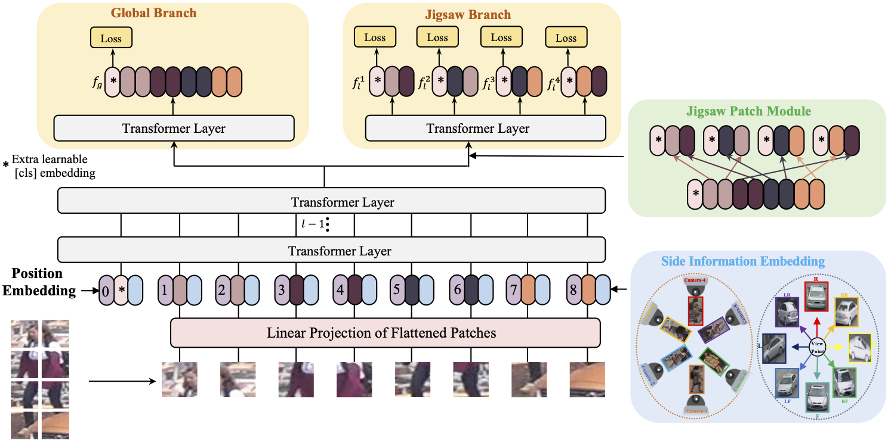

# BallShow TransReID 智能球员检索分析系统

  

## 🏀 项目简介
**BallShow-ReID** 是一个专门为动态变化大、遮挡严重、姿势复杂的“篮球场体育直播录像环境”打造的端到端**多模态实人重识别 (Person Re-Identification)** 与高光视频挖掘平台。

本方案在 **2024 第三届“信创杯” BallShow 预热赛** 中构建。基于最新的双分辨率 Vision Transformer 融合架构和轻量级 FastAPI 分布式服务，配齐了完善的 WebPC 版、原生微信小程序、React Native 手机 App。是一套开箱即用、工程解耦、体验流畅的体育 AI 商业级解决方案。

## 🚀 核心子系统与文档导航
整个仓库在物理结构上可清晰划分为底层 AI 训练流与上层多平台服务（部署在 `platform/` 内）。

- **[🤖 \> 模型训练与算法机制文档 (MODEL.md)](./MODEL.md)**
  - 基于 ViT-Base 的 `256×128` 与 `384×128` 双分辨率特征提取融合 (Dual-ViT Ensemble)。
  - Circle Loss / Triplet Loss / JPM 局部移位对抗模块。
- **[💻 \> 后端流媒体与微服务引擎文档 (BACKEND.md)](./platform/backend/BACKEND.md)**
  - FastAPI 控制流，JWT 鉴权，数据库。
  - YOLOv8 人体帧级裁片 / ReID 表决 / MoviePy 长片段剪接逻辑调度池。
- **[🌐 \> Web 大屏管理端文档 (FRONTEND.md)](./platform/frontend/FRONTEND.md)**
  - Vue 3 + Element Plus + ECharts 极其轻量的单文件运行离线大屏。
- **[📱 \> 原生跨端移动 App 文档 (MOBILE.md)](./platform/mobile_app/MOBILE.md)**
  - React Native + Expo SDK 54 编译。跨 iOS/Android。使用原生 VideoView 原生播放模块。
- **[💬 \> 微信原生生态小程序文档 (MINIPROGRAM.md)](./platform/wechat_miniprogram/MINIPROGRAM.md)**
  - WXML / WXSS 完全无栈原生框架。克服了平台级长轮询防杀与组件同层覆盖兼容难关。

## 🎯 业务工作流 (User Workflow)
1. **认证与入口**: 多端共享 JWT 通行证。登录首页获取当前 AI 服务器设备负载。
2. **实景搜人 (Image Search)**:
    - 用户从相册选取比赛截图。
    - 引擎瞬间将图像抽象为 768 维降维特征矩阵并归一化。
    - L2 全量度量距离测算返回最接近的 TOP-K Match 清单。
3. **录像高光挖掘 (Action Analysis)**:
    - `第一阶段上传`: 提供球星个人大头贴 / 全身照。
    - `第二阶段上传`: 分片式/大附件上传几十兆甚至更大的 .mp4 比赛实录。
    - `服务端流水线`: YOLO 侦测全视角目标 -> 每 15 帧抽认是否命中球星面貌躯干 -> 时序关联平滑 (Tracklets) -> `moviepy` 在内存无损按帧剥离组编出 `.mp4` 成果视频。
    - `客户端反馈`: 小程序即时通过图文时间轴和视频 Player 精确追溯每一分每一秒的高能暴扣投篮镜头！

## ⚡ 性能与指标
| 指标名称 | 测定值 | 环境条件 |
| --- | --- | --- |
| **Rank-1 精度** | 94.4% | BallShow Core Test |
| **mAP** | 91.8% | BallShow Core Test |
| 显存开销 | ~6.5 GB | RTX 4090 并行处理分析 |
| 单视频处理时延 | 录像总时长的 1/5 | 按帧率抽走查重阈值 0.7 计 |

## 🛠 开发快速启动

由于微服务模块化拆分解耦，如果只想看产品 Demo，只要保证 Backend 存活：

1. **部署 Python 运行依赖:** 切换进虚拟环境并执行 `pip install -r platform/requirements_platform.txt`。
2. **初始化并点燃核心:** 启动在根目录或 `platform/backend` 内运行 `python platform/backend/app.py` 开启 ASGI uvicorn 守护进程服务（默认在 `http://127.0.0.1:8000`）。
3. **开启全端体验:**
   - 【Web端】浏览器直戳：`http://127.0.0.1:8000/`。
   - 【手机APP】进入 `platform/mobile_app` 打出 `npx expo start` 用手机扫码。
   - 【小程序】下载并打开“微信开发者工具”，开辟 `platform/wechat_miniprogram` 挂入即可。
